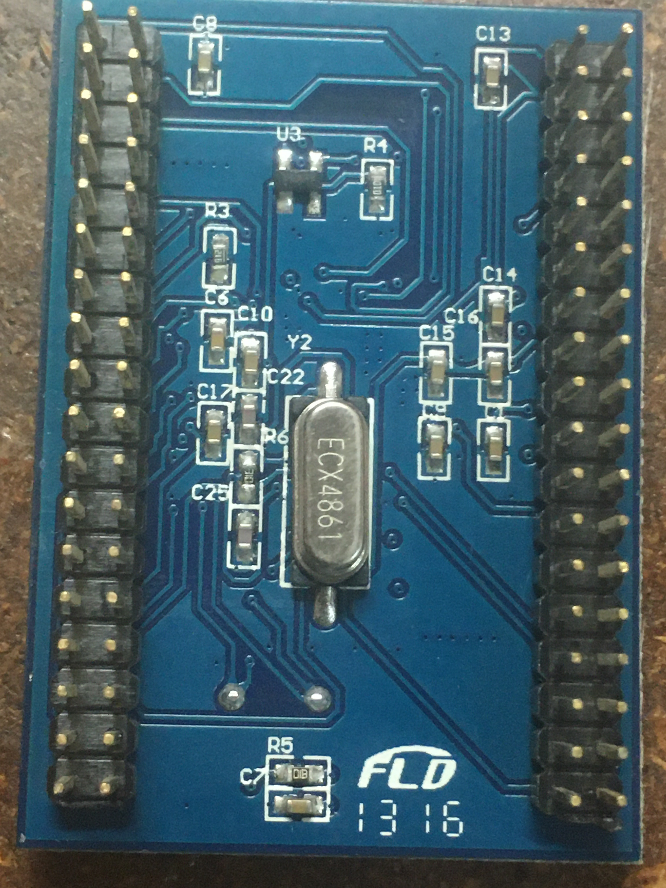
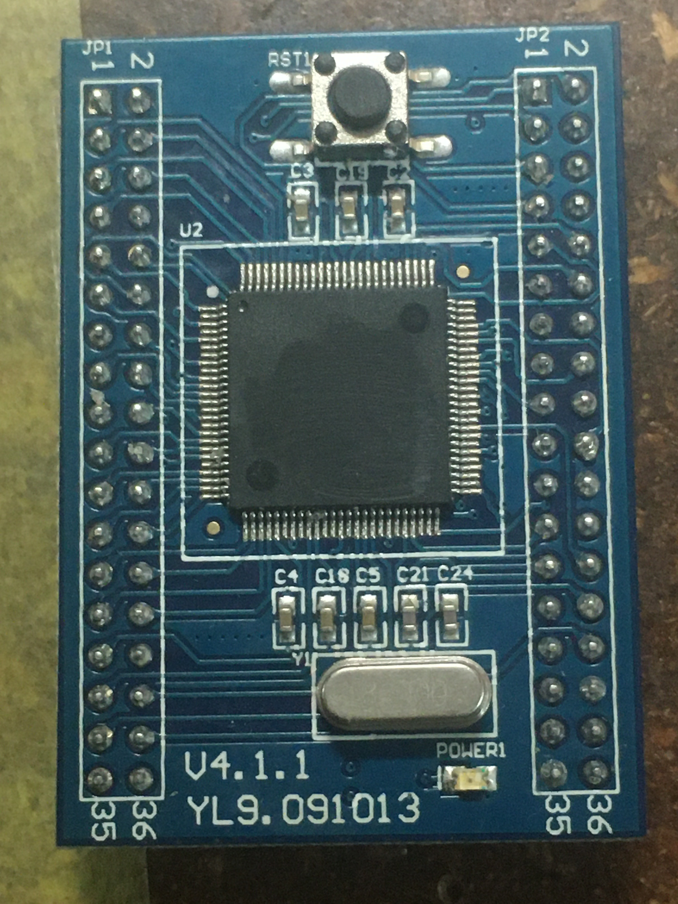
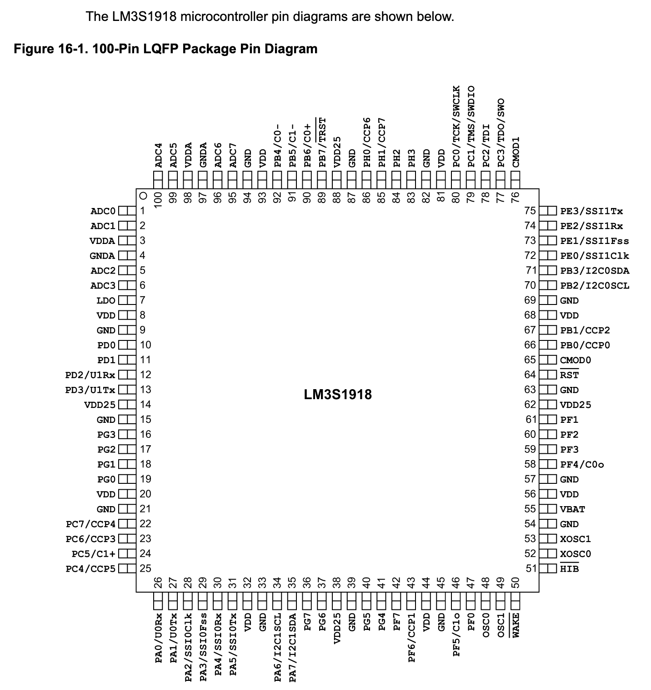

# CPU Board teardown and identification

See pictures under [`img`](https://github.com/CCHS-Melbourne/3D-Printers/tree/master/Up%20Plus%202/img) folder in this repo for the CPU board.

The IC is defaced but a parametric search on digikey yields the [Texas Instruments `LM3SA000-IQC50-A2T`](https://www.ti.com/lit/ds/symlink/lm3s1918.pdf).

Note: the internal SD card is just an MS-DOS formatted filesystem, so it just holds data being sent from their custom program to slice/print. This means that the firmware itself has to be extracted by other means (i.e JTAG?).
